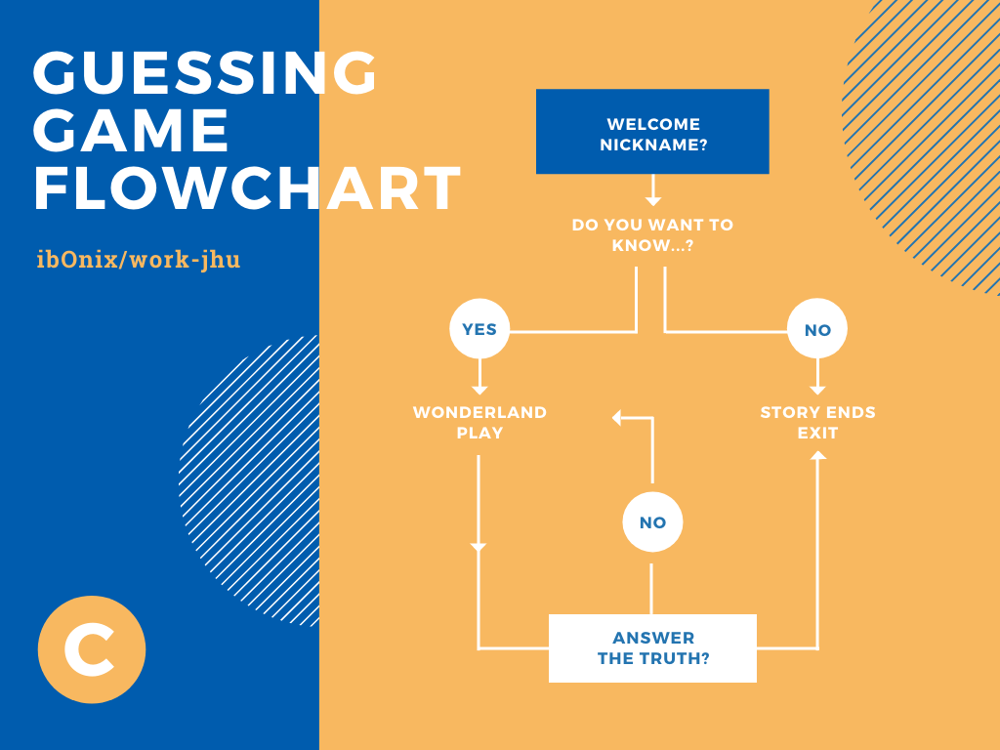

## Johns Hopkins University | [The Unix Workbench](https://seankross.com/the-unix-workbench/) | Guessing Game.
*A stressful solution to the [Coursera](https://www.coursera.org/learn/unix) proposal*. 

**Synopsis** \*:  I imagine, right now, you must be feeling a bit like Alice, tumbling down the rabbit hole? I can see it in your eyes. You have the look of a desperate man who accepts any code because he is expecting to wake up of this nightmare.  

Let me tell you why you are here. You have come because you know something. What you know you can't explain but you feel it. You've felt it your whole course, felt that something is wrong with your code. You don't know what, but it's there like a splinter in your mind, driving you mad. It is this feeling that brought you to me. Do you know what I'm talking about? 

> **[THE GUESSING GAME]**  

Do you want to know what it is? The Guessing Game is everywhere, it's all around us, here even in this website. You can see it out your window or on your shell. You feel it when you go to work, or go to Coursera to pay your taxes. It is the world that has been pulled over your eyes to blind you from the truth. 

You are a slave. Like everyone else, you payed your subscription, hoping the course would be easier, well guided, with a lot of videos. A prison for your mind. Unfortunately, no one can be told what code the Guessing Game is. You have to see it for yourself. 

This is your last chance. After this, there is no going back. You take the blue pill and the story ends. You try your best and you believe whatever you want to believe. You take the red pill and you stay in Wonderland and I show you how deep my bash code goes. Remember that all I am offering is the truth. Don't think it will work. 

Sean Kross, are we approved? 

> 
**Lines of code in guessinggame.sh**: 
45
> 
**Last Update**: 
Mon, 01 Jun 2020 17:36:14 +0200

###### \* Paraphrasing 'The Matrix' Shooting Script by Larry and Andy Wachowski. 

***
## Flowchart

